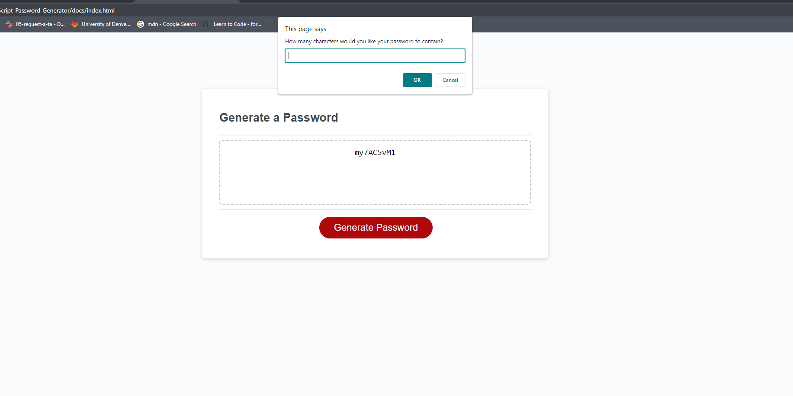

# JavaScript-Password-Generator
A repository for an application capable of generating random passwords.

## Descriptom
This webpage is designed to randomly generate a password between 8-128 characters long, and includes special characters.

### Project Focus
My primary focus for this project was to test my knowledge of javascript functions and variables.

#### Technologies Used
VS Code, Git Bash, GitHub, Google Chrome Dev Tools

##### Scope of functions
This page will provide me with a password generator.
